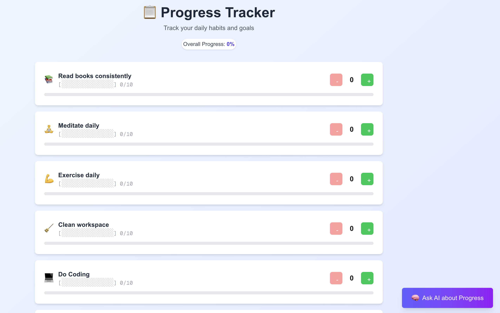
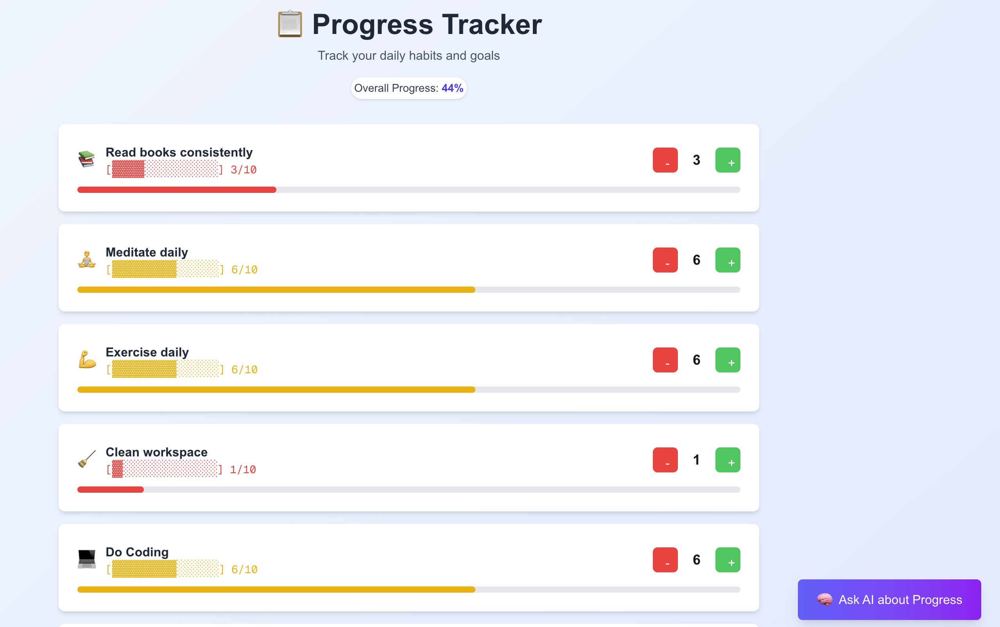
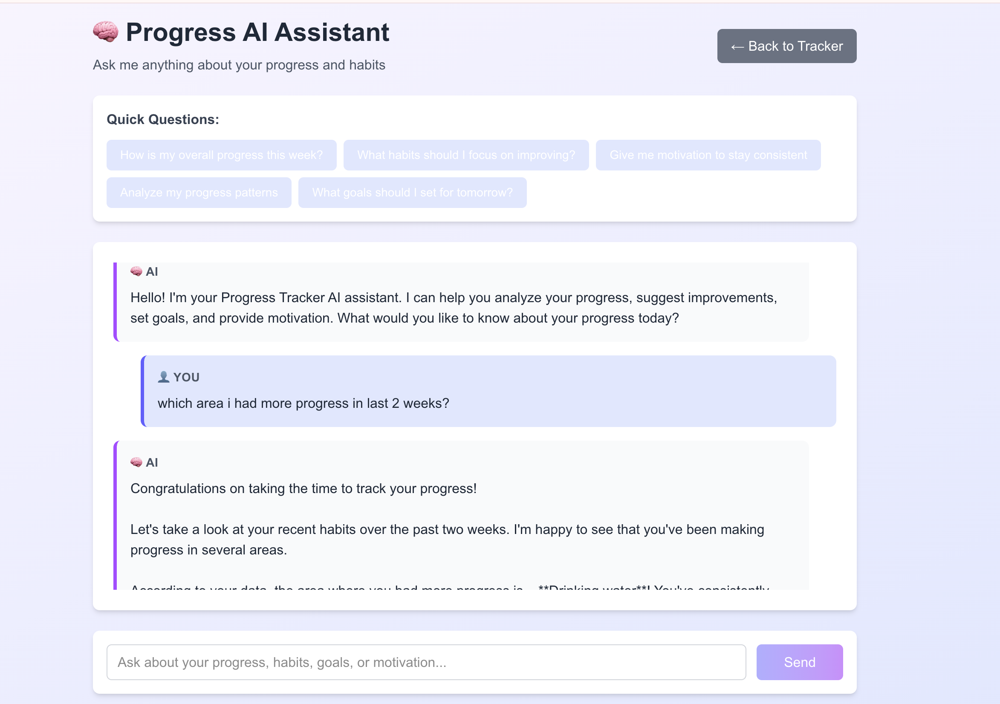
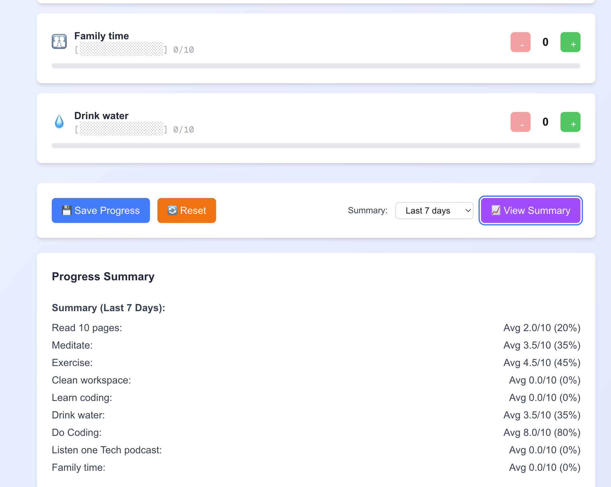

# 📋 Progress Tracker with AI Assistant

A beautiful, modern progress tracking application that helps you build consistent daily habits with AI-powered insights. Track your daily activities, visualize your progress with phone-like charging bars, and get personalized guidance from an AI assistant.



## ✨ Features

### 🎯 **Progress Tracking**
- **8 Pre-defined Habits**: Reading, Meditation, Exercise, Workspace Cleaning, Coding, Tech Podcasts, Family Time, and Water Intake
- **Visual Progress Bars**: Phone charging-style progress indicators (0-10 scale)
- **Color-coded Progress**: Red (0-3), Yellow (4-6), Blue (7-9), Green (10)
- **Real-time Updates**: Smooth animations and instant visual feedback
- **Overall Progress**: Aggregated percentage across all habits

### 💾 **Data Management**
- **Local Storage**: Persistent data storage in your browser
- **Daily Saves**: Save your progress with timestamps
- **Smart Reset**: Option to save before resetting progress
- **Historical Data**: All your progress history is preserved

### 📊 **Analytics & Insights**
- **Time-based Summaries**: View progress for last 7, 30, or 90 days
- **Average Calculations**: See your average performance per habit
- **Percentage Tracking**: Convert progress to percentage for easy understanding
- **Visual Progress Charts**: Beautiful progress visualization

### 🧠 **AI Assistant Integration**
- **Context-aware Chatbot**: AI knows your progress history and current habits
- **Progress Analysis**: Get insights about your patterns and trends
- **Motivation & Guidance**: Receive encouragement and improvement suggestions
- **Quick Questions**: Pre-built prompts for common queries
- **Ollama Integration**: Powered by llama3 model for intelligent responses

### 🎨 **Modern UI/UX**
- **Responsive Design**: Works perfectly on desktop and mobile
- **Tailwind CSS**: Beautiful, modern styling with gradients and shadows
- **Smooth Animations**: Engaging transitions and hover effects
- **Accessible**: Keyboard navigation and screen reader friendly
- **Dark/Light Theme**: Automatic theme adaptation

## 🚀 Demo

### Main Dashboard


### AI Chat Assistant  


### Progress Summary


## 🛠️ Technology Stack

- **Framework**: Next.js 15.3.3 with App Router
- **Language**: TypeScript
- **Styling**: Tailwind CSS v4
- **UI Components**: Custom components with shadcn/ui inspired design
- **AI Integration**: Ollama with llama3 model
- **Data Storage**: Browser localStorage
- **State Management**: React hooks (useState, useEffect)

## 📦 Installation

### Prerequisites
- Node.js 18+ 
- npm or yarn
- [Ollama](https://ollama.ai/) installed and running
- llama3 model downloaded in Ollama

### Setup Steps

1. **Clone the repository**
   ```bash
   git clone https://github.com/yourusername/progress-tracker-app.git
   cd progress-tracker-app
   ```

2. **Install dependencies**
   ```bash
   npm install
   ```

3. **Set up Ollama (for AI features)**
   ```bash
   # Install Ollama from https://ollama.ai/
   
   # Pull the llama3 model
   ollama pull llama3
   
   # Start Ollama server (runs on localhost:11434)
   ollama serve
   ```

4. **Start the development server**
   ```bash
   npm run dev
   ```

5. **Open in browser**
   Navigate to `http://localhost:3000` (or the port shown in terminal)

## 📖 Usage Guide

### 🏠 **Main Dashboard** (`/`)

1. **Track Progress**: Use the + and - buttons to update your daily progress for each habit
2. **Visual Feedback**: Watch the progress bars fill up and change colors as you improve
3. **Save Daily Progress**: Click "💾 Save Progress" to store your current state
4. **Reset When Needed**: Use "🔄 Reset" to start fresh (with option to save first)
5. **View Analytics**: Select time period and click "📈 View Summary" for insights

### 🧠 **AI Assistant** (`/chat`)

1. **Ask Questions**: Type your questions about progress, habits, and goals
2. **Use Quick Prompts**: Click pre-built questions for instant insights
3. **Get Contextual Help**: AI analyzes your actual progress data
4. **Receive Motivation**: Get personalized encouragement and tips

### 💡 **Example AI Conversations**

```
👤 You: "How is my overall progress this week?"
🧠 AI: "Based on your data, you've maintained a 67% completion rate this week. Your meditation and reading habits are strong at 8.5/10 average, but exercise could use some attention at 4.2/10. Consider setting small, achievable exercise goals!"

👤 You: "What habits should I focus on improving?"
🧠 AI: "Looking at your patterns, I'd recommend focusing on 'Family Time' and 'Exercise' as they show the most room for improvement. Try dedicating just 15 minutes daily to each - small consistent steps lead to big changes!"

👤 You: "Give me motivation to stay consistent"
🧠 AI: "You've already built amazing momentum! Your reading streak shows real dedication - you've completed it 6 out of 7 days this week. That's the power of consistency in action. Remember, progress isn't about perfection, it's about showing up every day, even if just for 5 minutes. You've got this! 💪"
```

## 🏗️ Project Structure

```
progress-tracker-app/
├── app/
│   ├── page.tsx              # Main dashboard
│   ├── chat/
│   │   └── page.tsx          # AI chat interface
│   ├── globals.css           # Global styles
│   └── layout.tsx            # Root layout
├── components/
│   └── ui/
│       ├── button.tsx        # Custom button component
│       └── input.tsx         # Custom input component
├── package.json              # Dependencies and scripts
├── tailwind.config.js        # Tailwind configuration
├── tsconfig.json            # TypeScript configuration
└── README.md                # Project documentation
```

## 🎯 Key Features Explained

### Progress Tracking System
- **Scale**: 0-10 for each habit (like phone battery percentage)
- **Persistence**: Data saved in browser's localStorage
- **Visual Indicators**: Progress bars with color coding
- **Aggregation**: Overall progress percentage across all habits

### AI Integration
- **Local AI**: Uses Ollama for privacy and offline capability
- **Context Injection**: AI receives your actual progress data
- **Conversation History**: Maintains chat context during session
- **Progress-focused Prompts**: Pre-built questions for common scenarios

### Data Analytics
- **Historical Tracking**: All progress saves are timestamped
- **Time-based Filtering**: 7, 30, 90-day summaries
- **Average Calculations**: Mean progress per habit over time periods
- **Trend Analysis**: Identify patterns in your habit consistency

## 🔧 Customization

### Adding New Habits
Edit the `tasks` array in `app/page.tsx`:

```typescript
const [tasks, setTasks] = useState<Task[]>([
  { name: "Your New Habit", progress: 0, icon: "🎯" },
  // ... existing tasks
]);
```

### Changing AI Model
Modify the model in `app/chat/page.tsx`:

```typescript
body: JSON.stringify({
  model: 'your-preferred-model', // Change from 'llama3'
  prompt: contextualInput,
  stream: false
}),
```

### Styling Customization
- Edit `app/globals.css` for global styles
- Modify Tailwind classes in components for design changes
- Update color schemes in progress bar logic

## 🤝 Contributing

1. Fork the repository
2. Create a feature branch (`git checkout -b feature/amazing-feature`)
3. Commit changes (`git commit -m 'Add amazing feature'`)
4. Push to branch (`git push origin feature/amazing-feature`)
5. Open a Pull Request

## 📝 License

This project is licensed under the MIT License - see the [LICENSE](LICENSE) file for details.

## 🙏 Acknowledgments

- [Next.js](https://nextjs.org/) for the amazing framework
- [Tailwind CSS](https://tailwindcss.com/) for beautiful styling
- [Ollama](https://ollama.ai/) for local AI capabilities
- [shadcn/ui](https://ui.shadcn.com/) for UI component inspiration

## 📸 Screenshots Needed

To complete this README, please add these screenshots to a `screenshots/` folder:

1. **main-dashboard.png** - Main progress tracking interface showing all habits
2. **dashboard.png** - Dashboard with some progress filled in
3. **ai-chat.png** - Chat interface showing conversation with AI
4. **summary.png** - Progress summary/analytics view
5. **mobile-view.png** - Mobile responsive design (optional)

## 🐛 Known Issues

- AI features require Ollama to be running locally
- Data is stored locally (not synced across devices)
- Reset functionality requires confirmation to prevent data loss

## 🚀 Future Enhancements

- [ ] Cloud data synchronization
- [ ] Multiple habit categories
- [ ] Habit streaks and achievements
- [ ] Data export functionality
- [ ] Social sharing features
- [ ] Push notifications for habit reminders
- [ ] Dark/light theme toggle
- [ ] Habit customization interface

---

**Built with ❤️ using Next.js and AI** 

*Start building better habits today! Track, analyze, and improve with AI-powered insights.*
